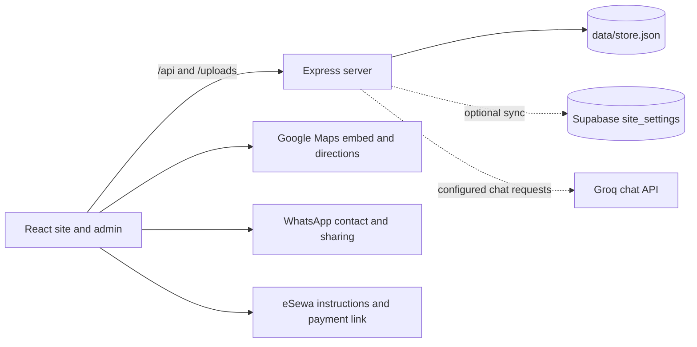

# Naresh MOTO Bike Service & Repair Center

A bilingual workshop website for learning about motorcycle services, checking availability and pricing, and contacting or booking Naresh Moto.

[](https://react.dev/)
[](https://www.typescriptlang.org/)
[](https://vite.dev/)
[](https://expressjs.com/)
[](https://supabase.com/)

## Table of Contents

- [About the Project](#about-the-project)
- [Key Features](#key-features)
- [Detailed Feature Documentation](#detailed-feature-documentation)
  - [Navigation and Preferences](#navigation-and-preferences)
  - [Hero and Bike Showcase](#hero-and-bike-showcase)
  - [Workshop Hours and Live Queue](#workshop-hours-and-live-queue)
  - [Services and Parts](#services-and-parts)
  - [Workshop Trust and Service Process](#workshop-trust-and-service-process)
  - [Packages and Pricing](#packages-and-pricing)
  - [Booking](#booking)
  - [Payments](#payments)
  - [Reviews and Ratings](#reviews-and-ratings)
  - [Before and After Gallery](#before-and-after-gallery)
  - [Workshop Feed and Gallery](#workshop-feed-and-gallery)
  - [Team, FAQ, and Blog](#team-faq-and-blog)
  - [Referrals, Social Sharing, and Announcements](#referrals-social-sharing-and-announcements)
  - [Contact, Map, Phone, and WhatsApp](#contact-map-phone-and-whatsapp)
  - [Naresh AI Assistant](#naresh-ai-assistant)
  - [Admin Portal and Workshop Control](#admin-portal-and-workshop-control)
  - [Legal Notices](#legal-notices)
  - [PWA, SEO, Accessibility, and Motion](#pwa-seo-accessibility-and-motion)
- [Tech Stack](#tech-stack)
- [System Architecture](#system-architecture)
- [Project Structure](#project-structure)
- [API Reference](#api-reference)
- [Getting Started](#getting-started)
- [Environment Variables](#environment-variables)
- [Admin Portal Guide](#admin-portal-guide)
- [Performance, Accessibility, and SEO Notes](#performance-accessibility-and-seo-notes)
- [Deployment](#deployment)
- [Future Improvements](#future-improvements)
- [Contact and Workshop Information](#contact-and-workshop-information)
- [Developer](#developer)
- [License](#license)

## About the Project

Naresh MOTO Bike Service & Repair Center is a public website and workshop dashboard for motorcycle and scooter riders in Dhore, Pakahamainpur, and the surrounding service area. It explains the workshop's repair capabilities and prices, shows customer feedback and workshop imagery, and gives visitors ways to request a slot or contact the shop.

The site brings service information, opening status, queue estimates, booking, payment instructions, and workshop contact details into one responsive experience. English and Nepali interface translations are included.

## Key Features

- Bilingual English and Nepali interface, with persistent light/dark theme preference.
- Scroll-controlled motorcycle assembly showcase, service catalog, packages, and opening status.
- Online booking form, customer reviews with moderation, and an admin-managed live queue.
- Before/after image comparison, workshop gallery, and workshop activity feed.
- Contact map, telephone and WhatsApp actions, referral sharing, and AI workshop assistant.
- Standalone admin dashboard for bookings, reviews, service content, announcements, hours, images, and analytics.
- Express API with local JSON persistence and optional Supabase synchronization.
- Installable web app shell with an offline page fallback.

## Detailed Feature Documentation

### Navigation and Preferences

`src/components/Header.tsx` provides the sticky site navigation, booking and payment entry points, a language toggle, and a light/dark theme toggle. `src/components/TopAnnouncementBar.tsx` displays time-sensitive workshop announcements and can route a visitor to booking, phone, or WhatsApp actions. The English and Nepali strings live in `src/data/en.json` and `src/data/ne.json`; `src/data/translations.ts` exposes them to components. The selected language and theme are stored in `localStorage` by `src/App.tsx`.

Visitors use the header controls to change language or appearance and use navigation links to move to page sections. Announcement content can be changed in the admin dashboard.

### Hero and Bike Showcase

`src/components/BikeShowcaseSection.tsx` combines the landing hero content with a scroll-pinned, frame-based bike assembly animation. Scrolling, dragging, keyboard input, and pointer interaction move through bike frames; image sizes and frame loading adapt to device conditions. The section includes booking and contact calls to action. `src/components/Hero.tsx` contains a separate hero component, while the current page mounts `BikeShowcaseSection` from `src/App.tsx`.

Bike image sequences are stored under `public/bike-frames/`; source images and branding artwork are in `src/assets/images/` and `public/`. `scripts/process-frames.mjs` describes an image-processing workflow, but it expects source frames at a machine-specific path, so that script is not portable without configuration changes.

### Workshop Hours and Live Queue

`src/hooks/useBusinessHours.ts` calculates open/closed status using Nepal time and checks date-bounded special-hours overrides from `/api/public/data`. The regular schedule is configured in `src/data/siteData.ts`. `src/components/LiveQueueWidget.tsx` shows bikes ahead, an estimated wait, and the workshop's queue message; it refreshes the API data periodically and can use a cached queue value when the request fails. Admins update queue values and hours overrides in `src/components/AdminDashboardModal.tsx`.

Visitors can check status on the page. Admins can set a temporary closure, special opening times, notice text, or queue estimate from the dashboard.

### Services and Parts

`src/components/WhatRollsThroughOurDoor.tsx` presents the primary service cards, while `src/components/ServicesGrid.tsx` renders the expanded service catalog and localized text. Service definitions and defaults are in `src/data/siteData.ts`; the public catalog can be updated from the admin portal. Services include routine servicing, engine/starting, brakes/tyres, electrical work, suspension, periodic maintenance, genuine parts fitting, and roadside assistance.

Visitors browse or filter the service cards and can open booking with a service preselected. `src/components/SparePartsViewer.tsx` is present in the source tree, but it is not mounted in the current `src/App.tsx` page flow.

### Workshop Trust and Service Process

`src/components/WhyChooseUs.tsx` summarizes the workshop's experience, parts, pricing, service time, and local focus. `src/components/HowItWorks.tsx` explains the four-step visit process, from arrival and inspection through repairs and road testing. Visitors can select a step card to read its details.

### Packages and Pricing

`src/components/PricingPackages.tsx` displays the three configured service packages and refreshes admin price overrides from `/api/public/data`. The defaults in `src/data/siteData.ts` cover a quick commuter check, standard periodic service, and a master engine/chassis overhaul. Admins can set package prices, names, descriptions, popularity, or visibility in the pricing tab.

Visitors compare package duration and inclusions and can open a booking with a package selected.

### Booking

The inline contact booking form is in `src/components/ContactLocation.tsx`. It submits customer, contact, service, date, time, and optional notes to `/api/public/bookings`. `src/components/BookingCalendarPicker.tsx` provides date and time selection. The header and service cards also open the global `src/components/BookingModal.tsx` flow.

The server validates and records booking requests in the store, creates a reference, and adds a dashboard notification. The current server's email notification helper writes notification payloads to `data/email-logs.json` and the console; it does not send email through a configured transactional email provider.

### Payments

`src/components/PaymentModal.tsx` presents eSewa payment instructions, an eSewa QR image, and a receipt-sharing flow. `src/components/BookingModal.tsx` offers a booking deposit flow. The receipt is generated in the browser and can be copied or sent to the workshop over WhatsApp; the displayed transaction reference is generated by the site.

The code does not verify a payment with a payment provider or expose a payment API. Treat this as a payment instruction and receipt-sharing flow, not automatic payment confirmation. The QR fallback image is `public/images/esewa-qr.jpg`.

### Reviews and Ratings

`src/components/ReviewsSection.tsx` displays the configured rating summary and seeded reviews from `src/data/siteData.ts`, merges in approved public reviews, and provides a submission form. New public submissions go to `/api/public/reviews` and are stored as pending until an admin approves them. Admin moderation is in the reviews tab of `src/components/AdminDashboardModal.tsx`.

Visitors can read, share, rate, and submit a review. Admins can approve, reject, or delete submitted reviews. The summary count and rating distribution are currently configured in the frontend rather than calculated from the review store.

### Before and After Gallery

`src/components/BeforeAfterGallery.tsx` provides an interactive before/after comparison, category filters, image cards, sharing, and an image lightbox. Its starting images are under `public/images/before-after/`; gallery data and editable image assignments arrive through the public data endpoint. Visitors drag or use touch input on the comparison and can open gallery items for a larger view.

### Workshop Feed and Gallery

`src/components/SocialProofFeed.tsx` shows a curated set of workshop activity cards with local like counts and share actions. These cards are defined in the frontend; they are not a live third-party social feed. `src/data/workshopGallery.ts` defines the bundled gallery catalog. `src/components/BeforeAfterGallery.tsx` displays gallery items, while admins can upload and manage gallery entries in `src/components/AdminDashboardModal.tsx`.

Workshop photos live mainly in `public/images/workshop/`. Visitors browse and share cards. Admins can add images with English and Nepali titles/captions, remove uploaded items, and assign images to site content.

### Team, FAQ, and Blog

- `src/components/AboutTeam.tsx` presents workshop and mechanic information from `src/data/siteData.ts`, including Nepali role and specialty strings where available. Admins can manage team entries and photos.
- `src/components/FaqAccordion.tsx` displays the FAQ list from `src/data/siteData.ts` and its Nepali equivalents in the component. Visitors expand one question at a time.
- `src/components/BlogSection.tsx` lists bilingual maintenance articles from `src/data/translations.ts`. Visitors can open an article, share it, or use its booking action.

### Referrals, Social Sharing, and Announcements

`src/components/ReferralCard.tsx` creates a referral code in the browser, offers copy and WhatsApp sharing actions, and records a claimed code through `/api/referrals`. The server returns the configured discount percentage and logs the claim. `src/components/SocialProofFeed.tsx`, `src/components/ReviewsSection.tsx`, and `src/components/BlogSection.tsx` also expose sharing actions.

`src/components/TopAnnouncementBar.tsx` reads announcement content from the public data endpoint, rotates messages, and supports booking, call, WhatsApp, or no-action announcements. Admins add, edit, remove, and reorder announcements from the dashboard.

### Contact, Map, Phone, and WhatsApp

`src/components/ContactLocation.tsx` displays workshop contact details, an embedded Google map, opening hours, and the inline booking form. `src/components/MobileStickyBar.tsx` provides mobile call, WhatsApp, and directions actions. `src/components/FloatingWhatsApp.tsx` provides a desktop WhatsApp entry point, QR display, and copy-phone action. `src/data/siteData.ts` is the source of the current workshop phone, address, hours, and map link.

Visitors can call, open directions, send a WhatsApp message, scan the WhatsApp QR, or submit a booking request.

### Naresh AI Assistant

`src/components/AfterHoursChatbot.tsx` provides the floating “Ask Workshop AI” chat widget, quick prompts, and follow-up actions. It sends a message, language, and recent conversation history to `/api/public/ai-chat`. The active server implementation in `server.ts` builds context from shop hours, queue, services, prices, mechanics, and announcements, then requests a response from Groq when configured. If the AI request fails or the key is missing, the server returns a local fallback response.

The assistant can answer workshop questions and guide a visitor to booking, calling, or WhatsApp. It is an informational assistant and does not represent a human mechanic.

### Admin Portal and Workshop Control

`src/App.tsx` serves the standalone dashboard at `/admin`. `src/components/AdminDashboard.tsx` mounts `src/components/AdminDashboardModal.tsx`, which has tabs for overview, queue, announcements, bookings, reviews, hours, pricing, mechanics, services, gallery, and analytics. The dashboard reads its data from `/api/admin/data` and can change booking states, moderate reviews, update hours and queue, edit content, and upload/manage images.

The login UI in `src/components/AdminLoginModal.tsx` uses Supabase email/password authentication. Protected server routes validate a Supabase access token and require an active `admin` row in the `admin_users` table. An `ADMIN_PASSWORD`-based `/api/admin/login` route also exists in `server.ts`, but the current login component does not call that endpoint. The frontend Supabase URL and anonymous key are required by `src/utils/supabase.ts` when the app module loads.

### Legal Notices

`src/components/Footer.tsx` opens `src/components/LegalModal.tsx` for the privacy, terms, and cookie notice content. `src/components/CookieConsent.tsx` offers accept and dismiss controls and links to the privacy notice. These are site-provided notices; they are not a separate legal-document service.

### PWA, SEO, Accessibility, and Motion

`src/main.tsx` registers `public/sw.js` in production. The service worker precaches the app shell, uses network-first navigation with an offline fallback, and does not cache API requests. `public/manifest.json`, `public/icon.svg`, PNG favicons, and `public/apple-touch-icon.png` provide install and icon metadata. `src/components/PwaInstallPrompt.tsx` responds to browser install events.

`index.html`, `public/robots.txt`, and `public/sitemap.xml` provide page metadata, structured business data, crawler rules, and sitemap links. The admin page adds `noindex` metadata. Accessibility support includes a skip link, labels and ARIA attributes, keyboard controls for interactive widgets, focus handling for modals, and reduced-motion handling. `src/App.tsx` lazily imports Lenis smooth scrolling after page load and leaves native scrolling in place when reduced motion is requested.

## Tech Stack

Versions below are the ranges declared in `package.json` (the leading `^` is retained).

| Category | Technology | Version | Purpose |
| --- | --- | --- | --- |
| UI | React | `^19.0.1` | Component-based site and dashboard |
| Language | TypeScript | `^5.7.3` | Frontend and server source |
| Build/dev server | Vite | `^8.3.0` | Frontend bundling and development server |
| Styling | Tailwind CSS | `^4.3.3` | Utility-first styling; loaded through `@tailwindcss/vite` `^4.3.3` |
| API | Express | `^4.22.3` | JSON API and production static serving |
| Database/auth | Supabase JS | `^2.117.2` | Optional persisted store, admin authentication and storage |
| 3D / rendering | Three.js | `^0.186.1`; React Three Fiber `^9.8.1`; Drei `^10.7.9` | Supporting libraries for the source-tree 3D components; these components are not mounted in the current page flow |
| Animation and scrolling | Motion `^12.23.24`; Lenis `^1.3.26` | Bike showcase animation and optional smooth scrolling; Lenis is skipped for reduced-motion preference |
| Icons | Lucide React | `^0.546.0` | Interface icons |
| Image processing | Sharp | `^0.35.5` | Server image conversion and frame-processing script |

The project uses `@vitejs/plugin-react` `^6.1.1`, `tsx` `^4.23.15`, `dotenv` `^17.2.3`, and `cors` `^2.8.6` for React transforms, TypeScript server execution, environment loading, and cross-origin middleware. `@google/genai`, `framer-motion`, and `multer` are declared dependencies, but no imports from them were found in the active application source.

## System Architecture

The browser renders the React application. In development, Vite proxies `/api` and `/uploads` to the Express server. In production, the Express process serves the built Vite assets and API routes. The server reads and writes `data/store.json`; if Supabase credentials are configured, it also hydrates and synchronizes the dashboard store in the `site_settings` table. Reviewable SQL schema and RLS examples are under `database/`.



Booking, review, referral, queue, announcement, pricing, service, gallery, and admin data flow through the Express API. The payment UI creates a receipt in the browser and hands it to WhatsApp; it does not receive a payment verification callback.

## Project Structure

```text
.
├── database/                 Supabase schema, RLS example, and seed script
├── data/                     Local JSON store and email-notification log
├── design-system/            Project design-system notes and audits
├── public/                   PWA files, icons, workshop images, uploads, bike frames
├── scripts/                  Image frame processing script
├── src/
│   ├── assets/images/        Imported source imagery
│   ├── components/           Public sections, forms, dashboard, and shared UI
│   ├── data/                 Business content, translations, and gallery entries
│   ├── hooks/                Reusable state hooks, including business hours
│   ├── utils/                Supabase client and request helper
│   ├── App.tsx               Page composition, preferences, and /admin routing
│   ├── index.css             Global styles and Tailwind import
│   └── main.tsx              React entry point and production service-worker setup
├── ui-ux-kit/                Bundled local design utility kit
├── .env.example              Environment-variable name template
├── index.html                Document metadata and structured data
├── package.json              Dependencies and npm scripts
├── server.ts                 Express API and production server
├── tsconfig.json             Frontend TypeScript configuration
├── tsconfig.server.json      Server TypeScript build configuration
└── vite.config.ts            Vite, React, Tailwind, aliases, and dev proxy
```

There are no dedicated `src/types/` or `src/context/` folders, and no standalone ESLint, PostCSS, or Tailwind config file in the project root. Tailwind is configured through its Vite plugin and `src/index.css`.

## API Reference

All routes are registered in `server.ts`. JSON request and response fields are summarized below; error responses generally use an `{ "error": "..." }` object.

| Method | Path | Purpose and data summary |
| --- | --- | --- |
| GET | `/api/queue` | Queue, announcements, and current hours override. |
| GET | `/api/pricing` | Active package price overrides. |
| GET | `/api/catalog` | Mechanics and active services. |
| GET | `/api/reviews` | Approved customer reviews. |
| GET | `/api/announcements` | Current announcements. |
| GET | `/api/public/data` | Combined public queue, hours, pricing, services, team, gallery, announcements, and approved reviews. |
| POST | `/api/bookings`, `/api/public/bookings` | Creates a booking from customer/contact, bike, service, date/time, note, and payment fields; returns the booking and reference. `/api/public/bookings` also has a legacy handler accepting `customerName`, phone, and service. |
| POST | `/api/reviews`, `/api/public/reviews` | Submits author, location, bike, rating, comment, and service; new records are pending moderation. |
| POST | `/api/reminders` | Records contact and target date for a service reminder; the response includes the reminder record. |
| POST | `/api/referrals` | Records a referral code claim and returns the discount percentage. |
| POST | `/api/chat`, `/api/public/ai-chat` | Accepts `message`, optional conversation history and language; returns an assistant reply and quick actions or fallback. |
| POST | `/api/admin/login` | Legacy password login accepting email, password, and optional `rememberMe`; sets a signed session cookie. The current UI uses Supabase Auth instead. |
| POST | `/api/admin/forgot-password` | Accepts an email and acknowledges a reset request; the current UI uses Supabase Auth reset instead. |
| POST | `/api/admin/logout` | Returns a success response. |
| GET | `/api/admin/data` | Returns all dashboard collections; requires a valid Supabase bearer token for an active admin user. |
| POST | `/api/admin/notifications/read` | Marks dashboard notifications as read. |
| POST | `/api/admin/bookings/:id/review` | Marks a booking reviewed. |
| POST, PUT, DELETE | `/api/admin/mechanics`, `/api/admin/mechanics/:id` | Creates, saves, or removes mechanic records and photos. |
| POST, PUT, DELETE | `/api/admin/services`, `/api/admin/services/:id` | Creates, saves, or removes service catalog records. |
| POST | `/api/admin/upload/:kind/:id` | Uploads and processes a mechanic or service image; accepts JPEG, PNG, or WebP up to 5 MB. |
| POST | `/api/admin/gallery/upload` | Processes and uploads a gallery image; accepts JPEG, PNG, or WebP up to 5 MB. |
| POST, DELETE | `/api/admin/gallery`, `/api/admin/gallery/:id` | Adds gallery metadata or deletes an image entry. |
| PUT | `/api/admin/gallery/assignments` | Saves site image assignments and before/after selections. |
| POST, PUT, DELETE | `/api/admin/announcements`, `/api/admin/announcements/:id` | Creates, edits, or deletes announcements. |
| POST | `/api/admin/announcements/:id/move` | Reorders an announcement using a direction value. |
| POST | `/api/admin/queue` | Saves queue count, estimated wait, visibility, and public note. |
| POST | `/api/admin/hours` | Saves dated special hours or closure override. |
| POST | `/api/admin/reviews/action` | Approves, rejects, or deletes a review. |
| POST | `/api/admin/bookings/status` | Updates booking status and admin note. |
| POST, PUT, DELETE | `/api/admin/pricing`, `/api/admin/pricing/:id` | Creates, updates, or hides a package price override. |

The protected dashboard routes use Supabase bearer-token authentication and check for an active `admin_users` record. The database schema and RLS examples are in `database/supabase-schema.sql` and `database/supabase-rls.sql`.

## Getting Started

### Prerequisites

- Node.js and npm. The repository does not specify a Node.js version.
- Supabase project credentials for the current frontend admin authentication module. Local JSON persistence is available for server data, but protected dashboard APIs also require Supabase configuration and an active admin user.

### Install and configure

```bash
npm install
cp .env.example .env
```

Set the environment variable names listed in [Environment Variables](#environment-variables) in `.env`. Do not commit `.env` or place server secrets in `VITE_` variables.

### Run locally

Start the API server in one terminal:

```bash
npm run dev:server
```

Start Vite in a second terminal:

```bash
npm run dev
```

Vite serves the frontend on port `5173` and proxies API requests to `http://127.0.0.1:3000` by default. Override the proxy destination with `VITE_API_TARGET`.

### Build, preview, and typecheck

```bash
npm run build
npm start
```

`npm run build` creates the Vite frontend build and compiles the server into `build-server/`. `npm start` runs the compiled production server. To preview only the Vite build locally, run:

```bash
npm run preview
```

The `lint` script runs the TypeScript compiler without emitting files; there is no ESLint script configured:

```bash
npm run lint
```

## Environment Variables

Names below come from `.env.example` and active source references. Values are intentionally omitted.

| Variable | Purpose | Required? |
| --- | --- | --- |
| `VITE_SUPABASE_URL` | Supabase URL used by the frontend auth client. | Required for the current app module to initialize. |
| `VITE_SUPABASE_ANON_KEY` | Supabase anonymous key used by the frontend auth client. | Required for the current app module to initialize. |
| `SUPABASE_URL` | Server-side Supabase URL for dashboard-store synchronization and protected API checks. | Optional for local JSON data; required for Supabase-backed admin API behavior. |
| `SUPABASE_SERVICE_ROLE_KEY` | Server-side Supabase service-role key. | Optional for local JSON data; required for server Supabase integration. Keep private. |
| `GROQ_API_KEY` | Enables responses from the Groq chat API. | Optional; the server returns a fallback reply if unavailable. |
| `ADMIN_PASSWORD` | Password secret used by the legacy `/api/admin/login` route. | Optional for the current Supabase login UI; required only for that legacy endpoint. |
| `PORT` | Express listen port; defaults to `3000`. | Optional. |
| `NODE_ENV` | Controls production server behavior and secure cookie attributes. | Optional; set to `production` for production. |
| `VITE_API_TARGET` | Vite development proxy destination; defaults to `http://127.0.0.1:3000`. | Optional. |
| `DISABLE_HMR` | Disables Vite HMR and file watching when set to `true`. | Optional; development only. |
| `GEMINI_API_KEY`, `APP_URL`, `SUPABASE_ANON_KEY` | Present in `.env.example`, but no active application source reference was found. | Not used by the current app. |

Example with names only:

```dotenv
VITE_SUPABASE_URL=
VITE_SUPABASE_ANON_KEY=
SUPABASE_URL=
SUPABASE_SERVICE_ROLE_KEY=
GROQ_API_KEY=
ADMIN_PASSWORD=
PORT=
NODE_ENV=
VITE_API_TARGET=
DISABLE_HMR=
```

## Admin Portal Guide

1. Open `/admin` and sign in with a provisioned Supabase Auth email and password.
2. Admin API access additionally requires an active user with the `admin` role in `admin_users`.
3. Use the dashboard tabs to manage bookings and statuses, review moderation, queue estimates, special hours, announcements, package overrides, mechanics, service catalog entries, gallery imagery, and analytics.
4. The forgot-password action in the login form requests a Supabase Auth email reset to `/admin`.

The `AdminDashboardModal` can render as an embedded dialog or as the standalone `/admin` page. The current `src/App.tsx` uses the standalone page. An older server-side password login endpoint remains in the API, but it is not wired to the current login component.

## Performance, Accessibility, and SEO Notes

- The bike showcase loads image frames around the active frame and selects a smaller rendering size on constrained devices. Animation loops pause when the showcase is not visible or the page is hidden.
- `src/main.tsx` detects low-memory, low-core, or data-saver devices and adds a `low-tier` class for CSS adaptations.
- Lenis is imported after the initial render and is skipped when the browser requests reduced motion. CSS also defines reduced-motion behavior.
- `index.html` contains page title, description, Open Graph/Twitter metadata, AutoRepair JSON-LD, theme color, and font preconnect/preload hints.
- `public/robots.txt` blocks admin paths from crawlers, and `public/sitemap.xml` lists public page sections.
- The app includes a skip-to-content link, descriptive accessible labels for key controls, keyboard support for interactive content, and focus handling for modals.
- No analytics tracker is currently active; the Google Analytics snippet in `index.html` is commented-out placeholder code.

## Deployment

The project has a production Node server setup: run `npm run build`, configure the needed server environment variables, then run `npm start`. The server serves the generated `dist/` frontend and API routes. Deploy the Node process to a host that supports persistent storage if using `data/store.json`; configure Supabase if the dashboard data should be synchronized to the database. Set the production environment to `NODE_ENV=production` and serve the application over HTTPS.

The repository does not define a hosting-provider-specific deployment configuration. A static-only Vite deployment can serve the public frontend, but the booking, admin, AI, and other `/api` features require the Express server.

## Future Improvements

These are planned ideas, not existing features:

- Integrate a payment provider callback so deposits can be verified automatically.
- Connect a transactional email provider; current email notifications are logged locally rather than delivered.
- Make the frame-processing script accept a configurable source directory instead of relying on a machine-specific path.
- Add automated API and browser-level regression coverage; no test script is currently defined.

## Contact and Workshop Information

Current values from `src/data/siteData.ts`:

- **Workshop:** Naresh Moto Repair Center
- **Location:** Dhore pakahamainpur - 1, Dhore, Nepal
- **Phone:** +977 982-9455583
- **Hours:** 6:00 AM – 8:00 PM, Sun–Sat

## Developer

Developed by **Chandan Kumar Sah**  
Department of Artificial Intelligence and Machine Learning

## License

All rights reserved. A license has not been chosen for this project.
